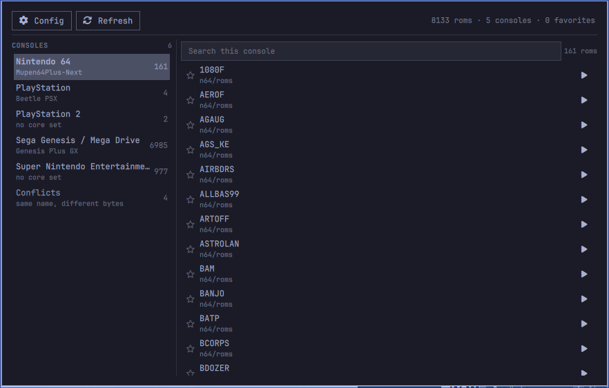
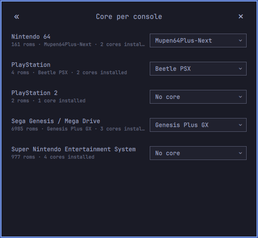

# Cartridge

A ROM library browser for the Omarchy bar. Cartridge finds the games in
`~/Games/roms`, works out which console each one belongs to, lets you pick the
RetroArch core per console, and launches games — including the ones buried two
levels deep inside a ROM set.




## Install

```bash
git clone https://github.com/audryus/cartridge.git ~/.config/omarchy/plugins/audryus.cartridge
omarchy plugin enable audryus.cartridge right
omarchy-restart-shell
```

**Dependencies**, all of them already on a normal Omarchy install:
`retroarch`, the `libretro-*` cores you want, `libretro-core-info` (for the
extension table), `bsdtar` (7z and rar), and `python3`. Nothing is installed at
runtime and cartridge runs no privileged operation.

## How it works

### Finding the games

`bin/cartridge-scan.py` walks `~/Games/roms` and opens every archive it finds
without unpacking it. Archives are read **two levels deep**, because a ROM set
is usually a zip of zips: your `mega/sega-genesis-romset-ultra-usa.zip` holds
zips, and each of those holds the `.md`.

zips are read with Python's `zipfile`; 7z and rar go through `bsdtar`. That
split is not only faster — `bsdtar` treats a member name as a glob, so a game
called `Ka-Ge-Ki - Fists of Steel (J) [b1].zip` matches nothing. Before this was
found, 4552 of the 5292 archives in your 32X set were being skipped silently.

### Working out the console

Cartridge does not keep a table of extensions. It reads
`/usr/share/libretro/info/*.info` and builds the table from `supported_extensions`,
so every system you have a core-info file for is supported, including ones with
no core installed yet.

Some care is needed, because that field is not clean:

- The database has several `systemname` values for one machine — PicoDrive and
  BlastEm say `Sega 8/16-bit (Various)` where Genesis Plus GX says
  `Sega Genesis`. Cartridge merges the known aliases, so `.md` is one console,
  not two.
- Cores that list hundreds of extensions (ScummVM, MAME, FBNeo, Dolphin, PPSSPP)
  are treated as catch-alls and left out of the table, or they would claim half
  the alphabet and make everything ambiguous.
- A console's own cartridge formats (`.gb`, `.gbc`, `.gba`, `.sfc`/`.smc`,
  `.z64`/`.v64`, `.sms`, `.gg`, `.lnx` and others, in `NATIVE_EXTS`) go to that
  console even when another core also lists them: bsnes plays `.gb` through
  the Super Game Boy, and mGBA is filed under Game Boy but reads `.gba`.
- An extension exactly one console claims is that console. An extension several
  claim — `.bin` on its own, Genesis or PlayStation — goes to **Unidentified**,
  because cartridge will not guess.
- A `.bin` next to a `.cue` is a PlayStation disc and nothing else. The `.cue`
  is the game, and the files it points at are its companions.

Read the whole database, not just installed cores: owning a PlayStation 2 game
should show PlayStation 2 in the list even before a PS2 core is installed, with
the config window saying no core can run it yet.

### The same game in two places

Your library has the same game more than once — every SNES game is both a loose
zip and a member of a 986-zip pack, all 161 N64 roms are loose *and* split
across seven rars. Cartridge keeps one copy:

- **Same name, same bytes** → a duplicate. The shallowest copy is shown, so
  the loose file beats the archived one and needs no unpacking. The other
  copies stay in `roms.json`, marked `hidden`, so deleting the loose file
  brings the archived one back on the next scan. Whatever a hidden copy had
  earned (a favorite, a play time) moves to the one shown. On your library that removed 1151 roms: 8133 remain out of 9284 found.
- **Same name, different bytes** → a **Conflict**. Copies are compared by CRC
  from the zip central directory, and by size where the format has no CRC. Your
  library has two of these, `Fatal Labyrinth (JU) [!]` and `ResQ`, and both
  happen to be unidentified 32X dumps, so they sit in Unidentified until you say
  what they are. Conflicts get their own column and you pick; cartridge does
  not.

### Launching

RetroArch cannot open a zip inside a zip, and a `.cue` is useless without the
`.bin` next to it. So Play stages the game first: the members that make it up
are streamed out to `~/.cache/cartridge/staging/<rom>/`, and RetroArch is pointed
at the real file. A loose file is played where it lies. Not `/tmp`: on Arch that
is a tmpfs, so a staged iso there is RAM held until reboot.

The staged copy is reused until the archive it came from changes, so replaying a
1.5 GB iso is instant the second time. Staged roms are capped at 16 GB in total
(`CARTRIDGE_STAGING_MAX`, in bytes); the least recently played make room, and a
game that does not fit on the disk is refused before anything is written. Then:

```
retroarch -L /usr/lib/libretro/mupen64plusnext_libretro.so /path/to/game.v64
```

No flags, so fullscreen, shaders and everything else stay whatever
`~/.config/retroarch/retroarch.cfg` says. RetroArch's log for each launch is at
`~/.cache/cartridge/logs/`, not next to your roms.

One core gets help. Play! (PlayStation 2), as Arch builds it, crashed on every
game, for two reasons found in its core dumps:

- It loads OpenGL through GLEW built for GLX, and under Wayland RetroArch makes
  an EGL context: every GL function stays null and the first frame jumps to
  address 0. Play! is started without `WAYLAND_DISPLAY`, so RetroArch uses X11
  through XWayland, where GLX works. Every other core keeps the session as it is.
- It serves `rom0:` from an empty folder, and a game that reads `rom0:ROMVER`
  aborts the whole process. Before Play! starts, cartridge writes a `ROMVER`
  (a US BIOS 2.20's, `0220AC20060905`) into the `rom0` folder named in
  `~/.config/Play Data Files/config.xml`, once, and never over one already there.

That makes Play! start; it does not make it a good emulator. Shadow of the
Colossus still dies in Play!'s own file code, and a game can still crash now and
then. LRPS2 (`libretro-lrps2-git`) runs far more of the library, given a BIOS
dumped from your own console in `~/Games/bios/pcsx2/bios/`.

### Cores

The config window lists every console found in the library, and for each one the
cores installed on this machine that can run it. Nintendo 64 offers
Mupen64Plus-Next and ParaLLEl N64; PlayStation offers Beetle PSX and Beetle PSX
HW. A console with roms but no installed core says so instead of offering an
empty list.

A console starts on the core [retrohandheldhq.com](https://retrohandheldhq.com/posts/retroarch-cores/)
recommends for it — Mesen for NES, bsnes for SNES, Gambatte, mGBA,
Mupen64Plus-Next, melonDS, Genesis Plus GX, Beetle Saturn, Beetle PSX HW,
PCSX2, PPSSPP, FBNeo, Flycast, Stella, ProSystem, Beetle Lynx, Virtual Jaguar —
or the alternative it names when only that one is installed
(`RECOMMENDED_CORES` in `bin/cartridge_lib.py`). That is a default, not a
decision: change it in the config window, or pick "No core" and it stays
that way. A console whose recommended core is not installed gets it once the
core is, from the ↻ button or the next scan.

The list of installed cores is taken at scan time. A core installed or removed
since then shows up with the ↻ button in the config window's header, which reads
`/usr/lib/libretro` again and rewrites `cores.json` alone, in a second, without
the full library scan Refresh does (`./bin/cartridge-state.py cores` from the
command line).

Cores are matched to their metadata by `corename` **and** by file name, because
Arch still installs some cores under their old names — `mednafen_psx_libretro.so`
next to a `mednafen_psx_libretro.info` that calls itself `Beetle PSX HW`. Without
the second lookup, 7 of your 42 cores would be unnameable and unselectable.

## Layout

```
manifest.json          service and bar-widget entry points
ui/Service.qml         the one shared store, and the IPC target
ui/shell.qml           the bar button and the two windows
ui/Cartridge.qml       the library window: toolbar, two columns
ui/Toolbar.qml         config and refresh, and what the library looks like
ui/ConsoleColumn.qml   left: consoles found, then Unidentified
ui/RomColumn.qml       right: search, and the roms of one console
ui/ConfigPopup.qml     the core-per-console window
ui/CartridgeData.qml   state, processes, the four JSON files
ui/CartridgeModel.js   sorting, search, conflicts — pure, and tested
bin/cartridge-scan.py    find the games, write the state
bin/cartridge-state.py   favorite, identify, pick a core, re-read the cores
bin/cartridge-play.py    stage the game, start RetroArch
bin/cartridge_lib.py     extension table, archive reading, JSON state
state/                   roms.json, user.json, consoles.json, cores.json, .lock (gitignored)
tests/                   scanner, regression and model tests; smoke_shell.sh for the live shell
assets/                  the two screenshots above
```

The windows are `PanelWindow`s with exclusive keyboard focus rather than
`PopupCard`s. An xdg-popup hands the keyboard to whatever is under the cursor,
and the cursor is in the bar, where nothing has focus — so typing into a dropdown
went nowhere.

The config window has a title bar: a double arrow back to the library on the
left, the name in the middle, and a close button on the right. The back arrow,
the close button, Escape and a click outside all go back to the library, because
choosing a core is a detour from browsing. Escape or a click outside the
library window closes it — from anywhere in it, including from the search box,
which holds the focus as soon as the window opens.

While either window is open the bar's open-panel indicator is lit, and
cartridge releases it when the last one closes.

Secondary text is drawn as an alpha of `Color.foreground` rather than a flat
grey. A flat grey reads fine on a panel background and disappears under a
theme's selection fill, and a fixed colour stops following the theme at all.

## Scanning is incremental

A cold scan of your library takes about two minutes: it decompresses 8 GB of ROM
sets to look inside them. A scan after that takes a quarter of a second, because
each file or folder is stamped with its size and mtime and only what moved is
read again. Adding one game to an existing ROM set re-reads one archive.

## State

Four JSON files in `state/`, written atomically, each change made under a lock
(`state/.lock`) so the scanner and the UI never drop each other's writes:

- `roms.json` — every rom as the scanner found it: where it is, which console
  detection says, its extension, its size and CRC. About 3 MB for 8000 roms,
  plus a size and mtime per file so a rescan knows what to skip. Only the
  scanner writes it.
- `user.json` — what you decided: favorites, play times, consoles you assigned
  by hand, keyed by rom id. Small, and the only file a favorite or a launch
  rewrites. Created from an older `roms.json` the first time.
- `consoles.json` — every console cartridge knows about, which core you picked,
  and the full catalogue of consoles for the Unidentified picker.
- `cores.json` — the cores installed on this machine.

Favorites, play times and hand-assigned consoles survive a rescan, including one
running while you change them: a rom's id is a hash of where it lives, so a rom
that did not move keeps its state. A console with no roms in a scan keeps the
core you picked for it, marked `present: false`.

An answer given to the wrong file is undone from the command line — the
identifier is the rom id in `roms.json`, or the archive path for a whole file:

```bash
./bin/cartridge-state.py assign <romId> auto     # forget, let detection decide
./bin/cartridge-state.py container <archive> auto # same, for every rom in a file
```

Detection's answer is kept in `roms.json`, so `auto` takes effect at once.

Override the library with `CARTRIDGE_ROMS_ROOT`, the state directory with
`CARTRIDGE_STATE_DIR`, and the cache with `CARTRIDGE_CACHE_DIR`.

## Tests

```bash
make test        # scanner tests, regression tests for state/archives/staging, model tests
make lint-qml    # parse every QML file the way the shell does
make smoke       # drive the running shell over IPC and check its log (SMOKE_REFRESH=1 also rescans)
make check
```

`make test` runs on every push and pull request in GitHub Actions
(`.github/workflows/test.yml`), in an Arch container with the same
`libretro-core-info` and `libarchive` the plugin uses. The QML wiring needs a
running Omarchy shell, so it is covered by `make smoke`, run by hand.

The scanner tests build a library in a temp directory — loose files, cue and
bin, a zip in a zip, a member name with `[b1]` in it, junk next to a rom — and
assert what cartridge does with it. The model tests run in node against the real
`CartridgeModel.js` with no shell and no display.

## Known limits

- Two copies of a game with the same name and size are compared by CRC when
  there is one to compare: a zip member carries it, and a loose file gets one
  worked out when needed. A 7z or rar member has none, so against one of those
  equal size is taken as equal bytes.
- The UI reads `roms.json` again only when a scan says it replaced it. Restoring
  or editing that file by hand needs a Refresh to show.
- Without the shared service -- under a replacement bar, which gets no service
  -- every bar registers the IPC target and the first one answers.
- Unidentified is large by nature: `.bin` is claimed by dozens of consoles, so a
  complete 32X rom set lands there in one piece — 5,288 of your roms did at
  first. The column has a per-file dropdown to place a whole archive at once,
  because one at a time is 5,288 clicks. The counts in the left column follow
  whatever you have placed, so this paragraph is about the first scan, not a
  promise.
- Archives are read two levels deep. A zip inside a zip inside a zip is not
  looked into.
- RetroArch's history is not read, so "most recently played" only knows about
  games started from cartridge.
- RetroArch is started with the environment the shell already has, which is the
  one that can open a window. Running `bin/cartridge-play.py` by hand from a
  terminal that lacks it gives RetroArch no display server, and it exits at
  `plugin_start_gfx` — which looks like a cartridge failure and is not one.

## Design record

Decisions taken while building this, and why:

| Question | Answer | Why |
| --- | --- | --- |
| Surface | `bar-widget`, popup windows | Compact launcher belongs in the bar; the library needs a surface, not a bar row |
| Surface state | one `service` for the shell, bar widgets per monitor | The library is parsed and watched once, and the IPC target registered once |
| State owner | `state/*.json` in the plugin, under a lock | One writer at a time, and it travels with the plugin |
| User vs scan state | `user.json` apart from `roms.json` | A favorite should write bytes, not the 3 MB library |
| Extraction cache | `~/.cache/cartridge/staging`, 0700, 16 GB LRU | A PS2 iso is 1.5 GB; `/tmp` is RAM on this system |
| Launch flags | none, beyond `-L` | `retroarch.cfg` is the user's, not cartridge's |
| Extension table | derived from `libretro-core-info` | The alternative is a table that rots |
| Ambiguous extension | Unidentified, never a guess | `.bin` is Genesis or PlayStation; cartridge is not going to pick |
| Duplicates | shallowest copy shown, others hidden | The loose file needs no unpacking |
| Conflicts | same name, different bytes | A game you own twice is not a decision to make |
| Favorites / recent / rest | in that order, then by name | As asked |
| Installed cores | matched by corename and by file name | Arch installs cores under old file names |
| Console catalogue | all 262 info files, not just installed | Owning a game should show its console before you install a core |
